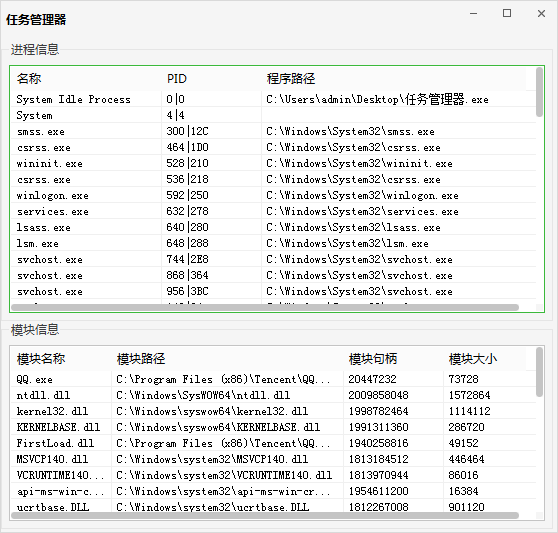
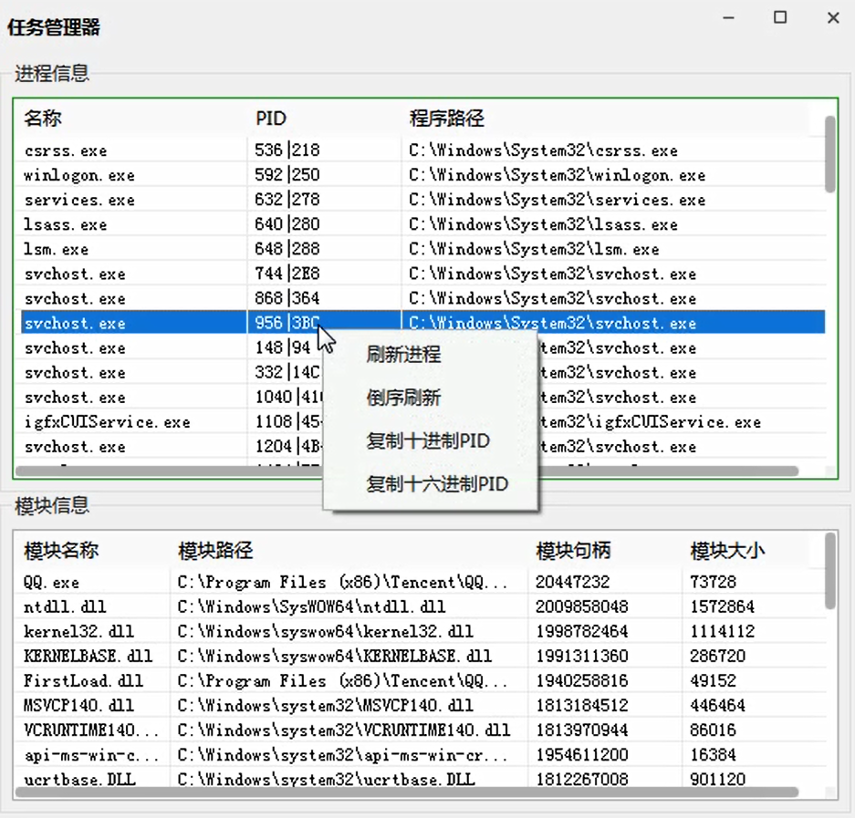

# 简易版任务管理器

> by tkzc00

# 简介

使用语言：易语言5.93

使用模块：

1. 精易模块[v11.1.5]
2. 华侨精绘皮肤模块4.3

软件功能：

1. 进程信息：进程名称、进程PID、程序路径
   1. 遍历系统进程
   2. 倒序遍历系统进程
   3. 复制十进制PID
   4. 复制十六进制PID
2. 模块信息：模块名称、模块路径、模块句柄、模块大小
   1. 双击进程项获取模块信息

# 软件截图

